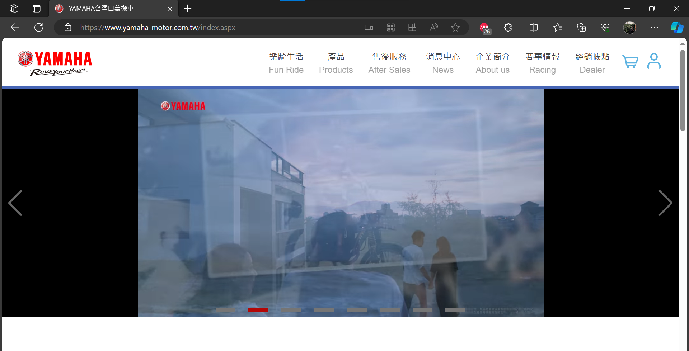

# 第2次練習-練習-PC2
>
>學號：111111102
> 
>姓名：張紘榤
> 
>作業撰寫時間：60 (mins，包含程式撰寫時間)
> 
>最後撰寫文件日期：2023/09/22
>

本份文件包含以下主題：(至少需下面兩項，若是有多者可以自行新增)
- [x] 說明內容
- [x] 個人認為完成作業須具備觀念

## 說明程式與內容

1.clone git@github.com:jack0628/112-1PC2.git
2.開啟資料夾
3.建立檔案a.drawio
4.選擇一個網站截圖畫面，我選擇(YAMAHA官網)

5.開始依照網頁樣本拉框線
## 個人認為完成作業須具備觀念
這次的練習主要是利用Draw.io Integration來建立線框稿，透過簡單的線框來呈現整個網頁的畫面，方便更了解整個網頁的架構，途中可能需要熟悉的是各個線框樣式代表的功能是什麼，才不會放錯。